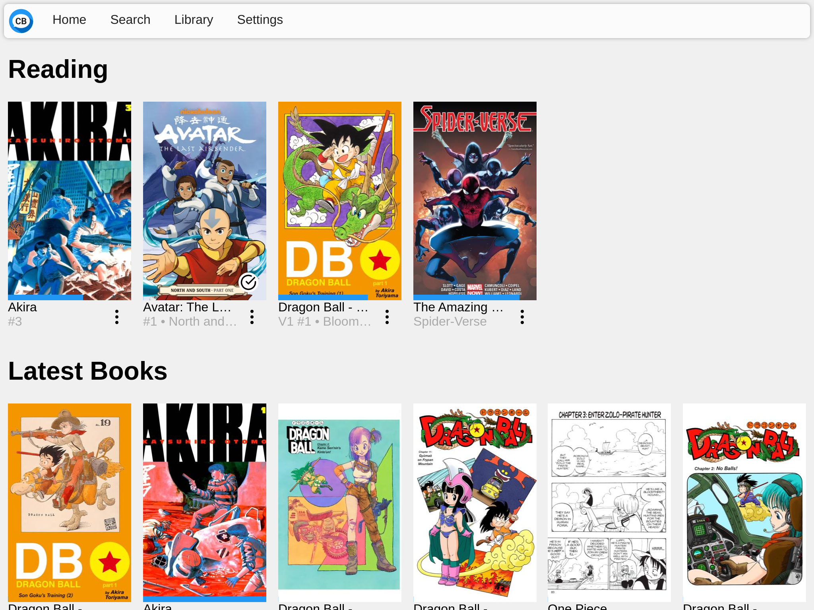
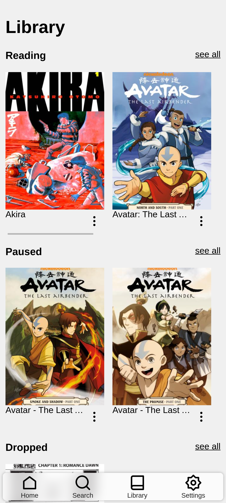

# ComicBox

## Tagline

<!--  -->

ComicBox is a free and open comic book reader. ComicBox lets you host your digital comic collection and access it from anywhere. It keeps track of your progress in each book and series you are reading so you can jump back in where you left off on any device. ComicBox allows you to download books to your device so you can keep reading even without the internet, then everything is synced back up when you are back online.

## Walkthrough

Check out the [screenshots](screenshots.md) to see how ComicBox in action.

## Technical Overview

The ComicBox frontend is a PWA written with preact that uses a service worker to allow for offline access. The frontend is written using offline first patterns to keep it responsive and provide the best user experience when in difficult network conditions. The data is kept in sync with the backend using CRDTs to ensure data modified offline is synced to the server properly and all devices are in the same state. ComicBox is powered by a go backend that serves books and manages the state.
